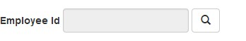
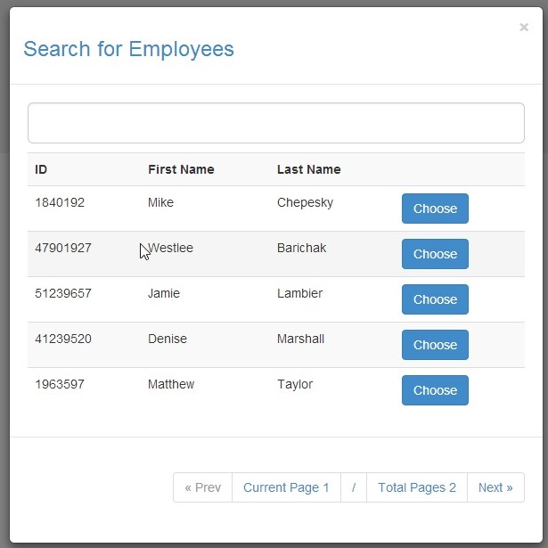

Generic List Of Values (LOV) Angular Directive
=========

With this angular directive you do not have to worried about create one popup each time you need to show a list of values where the user have to filter and choose some data.
##How to use
Inject the “lov-directive” and “ui.bootstrap” modules in your app:
```javascript
var demoApp = angular.module('demoApp', ['ui.bootstrap', 'lov-directive'])
    .config(function () {

               
    });

```
##Controller
The LOV need’s 3 properties and 1 function:
```javascript
        $scope.lovTitle = "Search for Employees";
        $scope.lovColumnList = ["ID", "First Name", "Last Name"];
        $scope.lovFieldList = ["employeeNumber", "firstName", "lastName"];
        
        $scope.lovCallBack = function (e) {
            //e parameter contains the whole object for the row selected

            $scope.SelectedEmployee = e;
        }
```
        
##View
A button is created inside a DIV with all necessary stuffs, just provide the settings from your controller:
```html
  <div lov
  				model="lovModel"
         	title="lovTitle"
         	callback="lovCallBack(e)"
         	columnlist="lovColumnList"
         	fieldlist="lovFieldList"
         	ng-show="lovModel != null">
  </div>
```

##Final Result

The markup rendered by angular:

```html
	<div lov="" 
			model="lovModel" 
			title="lovTitle" 
			callback="lovCallBack(e)" 
			columnlist="lovColumnList" 
			fieldlist="lovFieldList" 
			ng-show="lovModel != null" 
			class="ng-isolate-scope">
			<button type="button" 
				class="btn btn-default" 
				ng-click="openPopUp(model, title, callback, columnlist, fieldlist)"> 
				<span class="glyphicon glyphicon-search"></span>
			</button>
	</div>
```
###Button


###Pop-Up


##Dependencies
This directive depends on the following common dependencies:
- Bootstrap for styling: [http://getbootstrap.com]
- UI Bootstrap for angular [http://angular-ui.github.io/bootstrap], $modal component.
- jQuery


Enjoy it ! :smirk:
